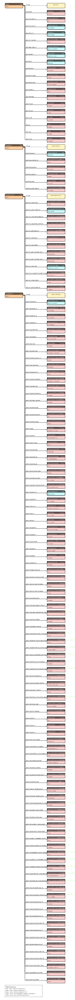

# gdsc_RDF config (senbero)

RDF-config is a tool to generate SPARQL queries, a schema diagram, and files required for [Grasp](https://github.com/dbcls/grasp), [TogoStanza](http://togostanza.org/) and ShEx validator from the simple YAML-based configuration files (see the [specification](./doc/spec.md)).


## TODO

* implement
  * support multiple models to be loaded in combination at once
* test

## GOAL

* DONE: capture the RDF data strucuture in ease
* DONE: generate SPARQL queries
* DONE: generate Grasp config file
* DONE: generate schema chart
* DONE: generate TogoStanza
* DONE: generate ShEx for RDF validation (data type and cardinality)
* generate SPARQLet for SPARQList

## SPECIFICATION

* [English version](./doc/spec.md)
* [Japanese version](./doc/spec_ja.md)

## USAGE

### convert.yaml


### Installation

```
% git clone https://github.com/dbcls/rdf-config.git
% cd rdf-config
% bundle install
```

### Generate schema ascii art

```
% bundle exec rdf-config --config config/gdsc --senbero
Gdsc [gdsc:Gdsc] (gdsc:1)
    |-- gdsc:dataset
    |       `-- dataset ("GDSC1")
    |-- gdsc:nlme_result_id
    |       `-- nlme_result_id (342)
    |-- gdsc:nlme_curve_id
    |       `-- nlme_curve_id (gdsc:15580432)
    |-- gdsc:cosmic_id
    |       `-- cosmic_id (gdscc:1240128)
    |-- gdsc:cell_line_name
    |       `-- cell_line_name ("ES5")
    |-- gdsc:sanger_model_id
    |       `-- sanger_model_id (gdscm:SIDM00263)
    |-- gdsc:tcga_desc
    |       `-- tcga_desc (tcgap:TCGA_xxxx)
    |-- gdsc:drug_id
    |       `-- drug_id (gdscd:1001)
    |-- gdsc:drug_name
    |       `-- drug_name ("Erlotinib")
    |-- gdsc:putative_target
    |       `-- putative_target ("EGFR")
    |-- gdsc:pathway_name
    |       `-- pathway_name ("EGFR signaling")
    |-- gdsc:company_id
    |       `-- company_id (1045)
    |-- gdsc:webrelease
    |       `-- webrelease ("Y")
    |-- gdsc:min_conc
    |       `-- min_conc (0.007813)
    |-- gdsc:max_conc
    |       `-- max_conc (0.1024)
    |-- gdsc:ln_ic50
    |       `-- ln_ic50 (-10.577744)
    |-- gdsc:auc
    |       `-- auc (0.985678)
    |-- gdsc:rmse
    |       `-- rmse (0.026081)
    `-- gdsc:z_score
            `-- z_score (-10.069813)
GdscDrug [gdscd:GdscDrug] (gdscd:1)
    |-- gdscd:drug_drug_id
    |       `-- drug_drug_id (gdscd:1001)
    |-- gdscd:drug_screening_site
    |       `-- drug_screening_site ("MGH")
    |-- gdscd:drug_drug_name
    |       `-- drug_drug_name ("Erlotinib")
    |-- gdscd:drug_synonyms
    |       `-- drug_synonyms ("Tarceva")
    |-- gdscd:drug_target
    |       `-- drug_target ("RG-1415")
    `-- gdscd:drug_target_pathway
            `-- drug_target_pathway ("CP-358774")
GdscCellLine [gdscc:GdscCellLine] (gdscc:1)
    |-- gdscc:cell_sample_name
    |       `-- cell_sample_name ("A253")
    |-- gdscc:cell_cosmic_identifier
    |       `-- cell_cosmic_identifier (gdscc:1290724)
    |-- gdscc:cell_whole_exome_sequencing
    |       `-- cell_whole_exome_sequencing ("Y")
    |-- gdscc:cell_copy_number_alterations
    |       `-- cell_copy_number_alterations ("Y")
    |-- gdscc:cell_gene_expression
    |       `-- cell_gene_expression ("Y")
    |-- gdscc:cell_methylation
    |       `-- cell_methylation ("Y")
    |-- gdscc:cell_drug_response
    |       `-- cell_drug_response ("Y")
    |-- gdscc:cell_gdsc_tissue_descriptor_1
    |       `-- cell_gdsc_tissue_descriptor_1 ("aero_dig_tract")
    |-- gdscc:cell_gdsc_tissue_descriptor_2
    |       `-- cell_gdsc_tissue_descriptor_2 ("head and neck")
    |-- gdscc:cell_cancer_type
    |       `-- cell_cancer_type (tcgap:TCGA_HNSC)
    |-- gdscc:cell_microsatellite_instability_status
    |       `-- cell_microsatellite_instability_status ("MSS/MSI-L")
    |-- gdscc:cell_screen_medium
    |       `-- cell_screen_medium ("D/F12")
    `-- gdscc:cell_growth_properties
            `-- cell_growth_properties ("Adherent")
GdscModel [gdscm:GdscModel] (gdscm:1)
    |-- gdscm:mod_model_id
    |       `-- mod_model_id (gdscm:SIDM01774)
    |-- gdscm:mod_sample_id
    |       `-- mod_sample_id ("SIDS01659")
    |-- gdscm:mod_patient_id
    |       `-- mod_patient_id ("SIDP01578")
    |-- gdscm:mod_parent_id
    |       `-- mod_parent_id ("SIDM00894")
    |-- gdscm:mod_model_name
    |       `-- mod_model_name ("PK-59")
    |-- gdscm:mod_synonyms
    |       `-- mod_synonyms ("NCI-SNU-503")
    |-- gdscm:mod_tissue
    |       `-- mod_tissue ("Pancreas")
    |-- gdscm:mod_cancer_type
    |       `-- mod_cancer_type ("Pancreatic Carcinoma")
    |-- gdscm:mod_cancer_type_ncit_id
    |       `-- mod_cancer_type_ncit_id ("C3850")
    |-- gdscm:mod_tissue_status
    |       `-- mod_tissue_status ("Metastasis")
    |-- gdscm:mod_sample_site
    |       `-- mod_sample_site ("Liver")
    |-- gdscm:mod_cancer_type_detail
    |       `-- mod_cancer_type_detail ("Pancreatic Carcinoma")
    |-- gdscm:mod_model_type
    |       `-- mod_model_type ("Cell Line")
    |-- gdscm:mod_growth_properties
    |       `-- mod_growth_properties ("Adherent")
    |-- gdscm:mod_model_treatment
    |       `-- mod_model_treatment ("Unknown")
    |-- gdscm:mod_sampling_day
    |       `-- mod_sampling_day (10.0)
    |-- gdscm:mod_sampling_month
    |       `-- mod_sampling_month (3.0)
    |-- gdscm:mod_sampling_year
    |       `-- mod_sampling_year (1993.0)
    |-- gdscm:mod_doi
    |       `-- mod_doi ("10.1002/(SICI)109...")
    |-- gdscm:mod_pmed
    |       `-- mod_pmed ("10.1182/blood.V69...")
    |-- gdscm:mod_msi_status
    |       `-- mod_msi_status ("MSS")
    |-- gdscm:mod_ploidy_snp6
    |       `-- mod_ploidy_snp6 (2.695571858)
    |-- gdscm:mod_ploidy_wes
    |       `-- mod_ploidy_wes (2.7803672058073996)
    |-- gdscm:mod_ploidy_wgs
    |       `-- mod_ploidy_wgs (1.82)
    |-- gdscm:mod_mutational_burden
    |       `-- mod_mutational_burden (1280.89)
    |-- gdscm:mod_model_comments
    |       `-- mod_model_comments ("NCI-H1339")
    |-- gdscm:mod_model_relations_comment
    |       `-- mod_model_relations_comment ("MUTZ-6 and MUTZ-7...")
    |-- gdscm:mod_cosmic_id
    |       `-- mod_cosmic_id (gdscc:1111111)
    |-- gdscm:mod_broad_id
    |       `-- mod_broad_id ("ACH-000205")
    |-- gdscm:mod_ccle_id
    |       `-- mod_ccle_id ("PK59_PANCREAS")
    |-- gdscm:mod_rrid
    |       `-- mod_rrid ("CVCL_4897")
    |-- gdscm:mod_hcmi
    |       `-- mod_hcmi ("CVCL_1873")
    |-- gdscm:mod_suppliers
    |       `-- mod_suppliers ("RIKEN:RCB1901")
    |-- gdscm:mod_supplier
    |       `-- mod_supplier ("RIKEN")
    |-- gdscm:mod_cat_number
    |       `-- mod_cat_number ("RCB1901")
    |-- gdscm:mod_species
    |       `-- mod_species ("Homo Sapiens")
    |-- gdscm:mod_gender
    |       `-- mod_gender ("Unknown")
    |-- gdscm:mod_ethnicity
    |       `-- mod_ethnicity ("Unknown")
    |-- gdscm:mod_age_at_sampling
    |       `-- mod_age_at_sampling (45.0)
    |-- gdscm:mod_family_history_of_cancer
    |       `-- mod_family_history_of_cancer (26.0)
    |-- gdscm:mod_prior_same_malignancy
    |       `-- mod_prior_same_malignancy ("Female")
    |-- gdscm:mod_prior_other_malignancy
    |       `-- mod_prior_other_malignancy ("White")
    |-- gdscm:mod_smoking_status
    |       `-- mod_smoking_status ("Unknown")
    |-- gdscm:mod_alcohol_exposure_intensity
    |       `-- mod_alcohol_exposure_intensity ("Unknown")
    |-- gdscm:mod_alcohol_consumption_per_week
    |       `-- mod_alcohol_consumption_per_week (5)
    |-- gdscm:mod_history_diabetes
    |       `-- mod_history_diabetes ("Unknown")
    |-- gdscm:mod_diabetes_treatment
    |       `-- mod_diabetes_treatment ("Smoker")
    |-- gdscm:mod_colorectal_cancer_risk_factors
    |       `-- mod_colorectal_cancer_risk_factors (false)
    |-- gdscm:mod_patient_history_of_gastrointestinal_disorder
    |       `-- mod_patient_history_of_gastrointestinal_disorder (false)
    |-- gdscm:mod_gastrointestinal_disorder_diagnosed
    |       `-- mod_gastrointestinal_disorder_diagnosed ("Crohn Disease")
    |-- gdscm:mod_prior_synchronous_colon_rectal_tumours
    |       `-- mod_prior_synchronous_colon_rectal_tumours (false)
    |-- gdscm:mod_history_prior_colon_polyps
    |       `-- mod_history_prior_colon_polyps ("Unknown")
    |-- gdscm:mod_previous_current_barretts_oesophagus
    |       `-- mod_previous_current_barretts_oesophagus ("Unknown")
    |-- gdscm:mod_reflux_disease_prior
    |       `-- mod_reflux_disease_prior (false)
    |-- gdscm:mod_reflux_disease_treatment
    |       `-- mod_reflux_disease_treatment ("Proton Pump Inhib...")
    |-- gdscm:mod_h_pylori_infection
    |       `-- mod_h_pylori_infection ("Never")
    |-- gdscm:mod_history_clinical_chronic_pancreatitis
    |       `-- mod_history_clinical_chronic_pancreatitis (false)
    |-- gdscm:mod_tumour_grade
    |       `-- mod_tumour_grade ("Poorly differenti...")
    |-- gdscm:mod_tnm_integrated
    |       `-- mod_tnm_integrated ("IIC")
    |-- gdscm:mod_tnm_t
    |       `-- mod_tnm_t ("T4b")
    |-- gdscm:mod_tnm_n
    |       `-- mod_tnm_n ("N0")
    |-- gdscm:mod_tnm_m
    |       `-- mod_tnm_m ("M0")
    |-- gdscm:mod_clinical_staging
    |       `-- mod_clinical_staging ("Stage IIIB")
    |-- gdscm:mod_metastasis_at_diagnosis
    |       `-- mod_metastasis_at_diagnosis ("Non-metastatic (c...")
    |-- gdscm:mod_metastatic_site_at_diagnosis
    |       `-- mod_metastatic_site_at_diagnosis ("Liver")
    |-- gdscm:mod_method_procurement
    |       `-- mod_method_procurement ("Surgical Resection")
    |-- gdscm:mod_sample_treatment
    |       `-- mod_sample_treatment ("Unknown")
    |-- gdscm:mod_sample_treatment_details
    |       `-- mod_sample_treatment_details ("Unknown")
    |-- gdscm:mod_radiation_type
    |       `-- mod_radiation_type ("5-FU")
    |-- gdscm:mod_prior_therapy_outcome
    |       `-- mod_prior_therapy_outcome ("Stable Disease")
    |-- gdscm:mod_tumour_regression_score
    |       `-- mod_tumour_regression_score ("Radiotherapy")
    |-- gdscm:mod_colon_polyps_present_at_time_of_tissue_collection
    |       `-- mod_colon_polyps_present_at_time_of_tissue_collection ("Unknown")
    |-- gdscm:mod_venous_invasion_present
    |       `-- mod_venous_invasion_present (true)
    |-- gdscm:mod_venous_invasion_type
    |       `-- mod_venous_invasion_type ("Extramural")
    |-- gdscm:mod_lymphatic_invasion_present
    |       `-- mod_lymphatic_invasion_present (false)
    |-- gdscm:mod_perineural_invasion_present
    |       `-- mod_perineural_invasion_present (false)
    |-- gdscm:mod_gastric_oesophageal_junction
    |       `-- mod_gastric_oesophageal_junction (false)
    |-- gdscm:mod_barretts_goblet_cells_present
    |       `-- mod_barretts_goblet_cells_present ("Unknown")
    |-- gdscm:mod_oesophageal_columnar_metaplasia
    |       `-- mod_oesophageal_columnar_metaplasia (true)
    |-- gdscm:mod_goblet_cells_oesophageal_columnar_mucosa
    |       `-- mod_goblet_cells_oesophageal_columnar_mucosa (true)
    |-- gdscm:mod_degree_of_dysplasia_non_cancerous_oesophageal_columnar_mucosa
    |       `-- mod_degree_of_dysplasia_non_cancerous_oesophageal_columnar_mucosa ("Unknown")
    |-- gdscm:mod_peripancreatic_lymph_nodes_tested_surgery
    |       `-- mod_peripancreatic_lymph_nodes_tested_surgery ("High grade dysplasia")
    |-- gdscm:mod_number_positive_peripancreatic_lymph_nodes
    |       `-- mod_number_positive_peripancreatic_lymph_nodes ("≥4")
    |-- gdscm:mod_mlh1_expression_by_ihc
    |       `-- mod_mlh1_expression_by_ihc ("Negative")
    |-- gdscm:mod_mlh1_promoter_methylation_status
    |       `-- mod_mlh1_promoter_methylation_status ("Not Assessed")
    |-- gdscm:mod_msh2_expression_by_ihc
    |       `-- mod_msh2_expression_by_ihc ("Positive")
    |-- gdscm:mod_pms2_expression_by_ihc
    |       `-- mod_pms2_expression_by_ihc ("Negative")
    |-- gdscm:mod_msh6_expression_by_ihc
    |       `-- mod_msh6_expression_by_ihc ("Positive")
    |-- gdscm:mod_braf_mutation_identified
    |       `-- mod_braf_mutation_identified (true)
    |-- gdscm:mod_braf_expression_by_ihc
    |       `-- mod_braf_expression_by_ihc ("Negative")
    |-- gdscm:mod_pik3ca_mutation_identified
    |       `-- mod_pik3ca_mutation_identified (false)
    |-- gdscm:mod_pten_expression_by_ihc
    |       `-- mod_pten_expression_by_ihc ("Negative")
    |-- gdscm:mod_pten_mutation_identified
    |       `-- mod_pten_mutation_identified (false)
    |-- gdscm:mod_kras_mutation_identified
    |       `-- mod_kras_mutation_identified (false)
    |-- gdscm:mod_mismatch_repair_status
    |       `-- mod_mismatch_repair_status ("Evidence of MMR p...")
    |-- gdscm:mod_preoperative_ce_alevel
    |       `-- mod_preoperative_ce_alevel (2.2)
    `-- gdscm:mod_crispr_ko_data
            `-- mod_crispr_ko_data (false)

```

### Generate schema diagram

```
% bundle exec rdf-config --config config/gdsc --schema > gdsc.svg
```



### Generate RDF or JSON-LD

To generate RDF or JSON-LD from CSV, XML, or JSON files, run rdf-config with the --convert option.

```
% rdf-config --config [directory of the configuration file] --convert [--format output format]
```

To generate Turtle
```
% bundle exec rdf-config --config config/gdsc --convert --format turtle > config/gdsc/output.ttl
```

To generate JSON-LD

```
% bundle exec rdf-config --config config/gdsc --convert --format json-ld > config/gdsc/output.json
```

