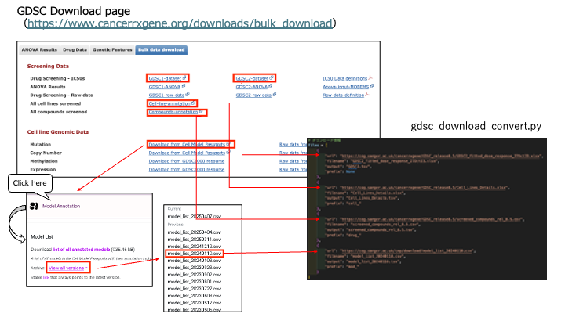
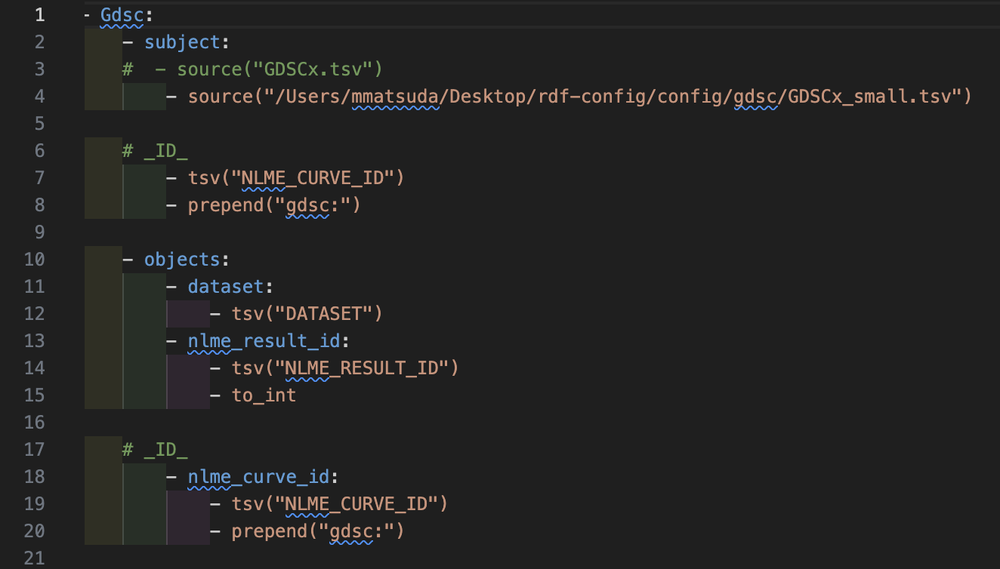

# gdsc

The Genomics of Drug Sensitivity in Cancer (GDSC) database is a large-scale resource that compiles genetic and pharmacological information regarding drug sensitivity in cancer cell lines.

## gdsc Conversion with RDF-config

### RDF Config (senbero)

RDF-config is a tool to generate SPARQL queries, a schema diagram, and files required for [Grasp](https://github.com/dbcls/grasp), [TogoStanza](http://togostanza.org/) and ShEx validator from the simple YAML-based configuration files (see the [specification](./doc/spec.md)).

### Specification

* [English version](./doc/spec.md)
* [Japanese version](./doc/spec_ja.md)

## Usage

This section describes how to install `rdf-config`, download GDSC datasets, and convert them into RDF or JSON-LD format.

### Installation

```
% git clone https://github.com/dbcls/rdf-config.git
% cd rdf-config
% bundle install
```

## Download Dataset

Download data from the following web site.

[Genomics of Drug Sensitivity in Cancer](https://www.cancerrxgene.org/downloads/bulk_download)



Note: This command assumes you are in the rdf-config/ directory.

```
% python3 ./config/gdsc/scripts/gdsc_download_convert.py

```

Check raw files and tsv files in directory.

```
└── config
    └── gdsc
        ├── data
        │   ├── raw
        │   │   ├── Cell_Lines_Details.xlsx
        │   │   ├── GDSC2_fitted_dose_response_27Oct23.xlsx
        │   │   ├── model_list_20240110.csv
        │   │   └── screened_compounds_rel_8.5.csv
        │   └── tsv
        │       ├── Cell_Lines_Details.tsv
        │       ├── GDSC2.tsv
        │       ├── model_list_20240110.tsv
        │       └── screened_compounds_rel_8.5.tsv
        └── scripts
            └── gdsc_download_convert.py
```

## Conversion to RDF/JSON-LD

### Data Set for Conversion

- convert.yaml
- model.yaml
- prefix.yaml
- endpoint.yaml
- schema.yaml
- sparql.yaml
- stanza.yaml

### Edit Configuration (convert.yaml)

Define rules (procedures) for generating RDF and JSON-LD from CSV and TSV files, and describe them in YAML format.

Tips
- The top-level key (e.g., Gdsc) should be defined as a list item by adding a '-'.
- Indentation should be done with exactly 2 half-width spaces.
- Include - subject and - objects.
- Confirm the path for - source. 



### Command Syntax

To generate RDF or JSON-LD from CSV, XML, or JSON files, run rdf-config with the --convert option.

```
% rdf-config --config [directory of the configuration file] --convert [--format output format]
```

Examples:

To convert TSV into Turtle format, run the following command:
```
% bundle exec rdf-config --config config/gdsc --convert --format turtle > config/gdsc/output.ttl
```

To convert TSV into JSON-LD format, run the following command:

```
% bundle exec rdf-config --config config/gdsc --convert --format json-ld > config/gdsc/output.json
```

### Generate Schema Diagram (ASCII)

```
% bundle exec rdf-config --config config/gdsc --senbero
Gdsc [gdsc:Gdsc] (gdsc:1)
    |-- gdsc:dataset
    |       `-- dataset ("GDSC1")
    |-- gdsc:nlme_result_id
    |       `-- nlme_result_id (342)
    |-- gdsc:nlme_curve_id
    |       `-- nlme_curve_id (gdsc:15580432)
    |-- gdsc:cosmic_id
    |       `-- cosmic_id (gdscc:1240128)
    |-- gdsc:cell_line_name
    |       `-- cell_line_name ("ES5")
    |-- gdsc:sanger_model_id
    |       `-- sanger_model_id (gdscm:SIDM00263)
    |-- gdsc:tcga_desc
    |       `-- tcga_desc (tcgap:TCGA_xxxx)
    |-- gdsc:drug_id
    |       `-- drug_id (gdscd:1001)
    |-- gdsc:drug_name
    |       `-- drug_name ("Erlotinib")
    |-- gdsc:putative_target
    |       `-- putative_target ("EGFR")
    |-- gdsc:pathway_name
    |       `-- pathway_name ("EGFR signaling")
    |-- gdsc:company_id
    |       `-- company_id (1045)
    |-- gdsc:webrelease
    |       `-- webrelease ("Y")
    |-- gdsc:min_conc
    |       `-- min_conc (0.007813)
    |-- gdsc:max_conc
    |       `-- max_conc (0.1024)
    |-- gdsc:ln_ic50
    |       `-- ln_ic50 (-10.577744)
    |-- gdsc:auc
    |       `-- auc (0.985678)
    |-- gdsc:rmse
    |       `-- rmse (0.026081)
    `-- gdsc:z_score
            `-- z_score (-10.069813)
GdscDrug [gdscd:GdscDrug] (gdscd:1)
    |-- gdscd:drug_drug_id
    |       `-- drug_drug_id (gdscd:1001)
    |-- gdscd:drug_screening_site
    |       `-- drug_screening_site ("MGH")
    |-- gdscd:drug_drug_name
    |       `-- drug_drug_name ("Erlotinib")
    |-- gdscd:drug_synonyms
    |       `-- drug_synonyms ("Tarceva")
    |-- gdscd:drug_target
    |       `-- drug_target ("RG-1415")
    `-- gdscd:drug_target_pathway
            `-- drug_target_pathway ("CP-358774")
GdscCellLine [gdscc:GdscCellLine] (gdscc:1)
    |-- gdscc:cell_sample_name
    |       `-- cell_sample_name ("A253")
    |-- gdscc:cell_cosmic_identifier
    ...
(Some entries omitted for brevity)

```

### Generate Schema Diagram

```
% bundle exec rdf-config --config config/gdsc --schema > gdsc.svg
```
[gdsc schema](./doc/figure/gdsc.svg)
