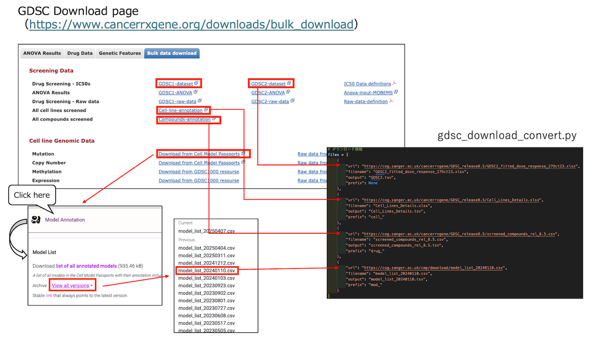

# GDSC RDF Conversion Guide

# GDSC

The Genomics of Drug Sensitivity in Cancer (GDSC) is a large-scale public database that provides pharmacogenomic data, including drug response profiles and genomic features, across various human cancer cell lines.

## RDF Conversion with RDF-config

Install **rdf-config** to convert GDSC data into RDF (Turtle) or JSON-LD.Download the data separately.

### About RDF-config (senbero)

[RDF-config](https://github.com/dbcls/rdf-config) is a tool that generates

- SPARQL queries
-  Schema diagrams (ASCII / SVG)
- Configuration files for:
    - [Grasp](https://github.com/dbcls/grasp)
    - [TogoStanza](http://togostanza.org/)
    - [ShEx Validator](https://shex.io/) 

These are generated from **simple YAML configuration files**.

📘 For YAML syntax and configuration rules, see the RDF-config Specification:

[English](https://github.com/dbcls/rdf-config/blob/master/doc/spec.md) | [Japanese](https://github.com/dbcls/rdf-config/blob/master/doc/spec_ja.md)

### Installation of rdf-config

💡 Run the following commands in your working directory (e.g., ~/rdf-config/):

```
git clone https://github.com/dbcls/rdf-config.git
cd rdf-config
bundle install
```

## Download GDSC Dataset

Datasets can be downloaded from the following website:

[Genomics of Drug Sensitivity in Cancer](https://www.cancerrxgene.org/downloads/bulk_download)



⚠️Save all `.tsv` files into: rdf-config/config/gdsc.

```
python3 ./config/gdsc/scripts/gdsc_download_convert.py
```

Check raw files and tsv files in directory.

```
└── config
    └── gdsc
        ├── data
        │   ├── raw
        │   │   ├── Cell_Lines_Details.xlsx
        │   │   ├── GDSC2_fitted_dose_response_27Oct23.xlsx
        │   │   ├── model_list_20240110.csv
        │   │   └── screened_compounds_rel_8.5.csv
        │   └── tsv
        │       ├── Cell_Lines_Details.tsv
        │       ├── GDSC2.tsv
        │       ├── model_list_20240110.tsv
        │       └── screened_compounds_rel_8.5.tsv
        └── scripts
            └── gdsc_download_convert.py
```

## Convert to RDF / JSON-LD

### Required Config Files

Ensure the following files exist in config/gdsc/:
* convert.yaml
* model.yaml
* prefix.yaml
* endpoint.yaml
* schema.yaml
* sparql.yaml
* stanza.yaml

### RDF/JSON-LD Conversion Commands

💡 Note: Run from the root directory of rdf-config.

Convert TSV to Turtle:
```
bundle exec rdf-config --config config/gdsc --convert --format turtle > config/gdsc/output.ttl
```

Convert TSV to JSON-LD:

```
bundle exec rdf-config --config config/gdsc --convert --format json-ld > config/gdsc/output.json
```

## Visualize the Schema

### Generate ASCII Schema Diagram

```
bundle exec rdf-config --config config/gdsc --senbero
```

```
Gdsc [gdsc:Gdsc] (gdsc:1)
    |-- gdsc:dataset
    |       `-- dataset ("GDSC1")
    |-- gdsc:nlme_result_id
    |       `-- nlme_result_id (342)
    |-- gdsc:nlme_curve_id
    |       `-- nlme_curve_id (gdsc:15580432)
    |-- ...
GdscDrug [gdscd:GdscDrug] (gdscd:1)
    |-- gdscd:drug_drug_id
    |       `-- drug_drug_id (gdscd:1001)
    |-- gdscd:drug_screening_site
    |       `-- drug_screening_site ("MGH")
    |-- gdscd:drug_drug_name
    |       `-- drug_drug_name ("Erlotinib")
    |-- ...

```

### Generate SVG schema diagram

```
bundle exec rdf-config --config config/gdsc --schema > gdsc.svg
```

📍Output:[gdsc.svg](./doc/figure/gdsc.svg)

### Tips for Writing convert.yaml

- Always use a hyphen `-` before **top-level** entities (e.g., `- TcgaFiles:`)
- Use 2 spaces (not tabs) for indentation
- Define - subject: and - objects: under each entity
- Ensure source: matches the TSV file field name


Script for Creating Small Test Data


This script generates a small sample dataset for testing RDF conversion workflows. You can customize the content and structure as needed.

💡 Run the following commands in your working directory (e.g., ~/rdf-config/):

```
python3 ./config/gdsc/scripts/gdscgdsc_small_extract_rows_from_tsv.py
```
